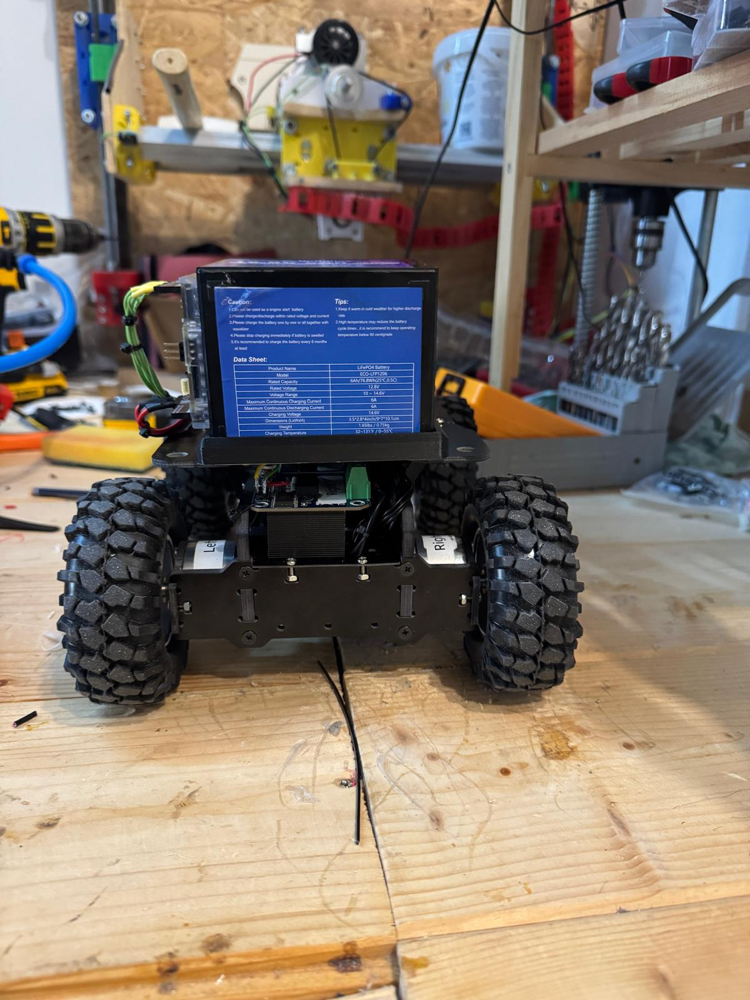
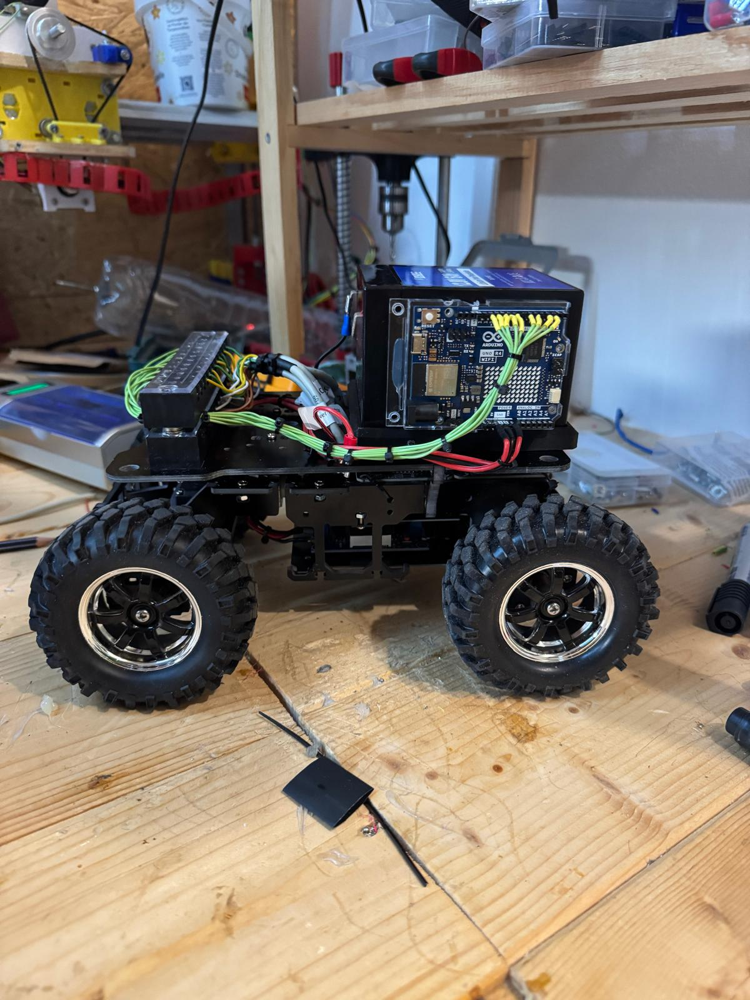

# 📚 Indice

- [🔧 Struttura del progetto](#-struttura-del-progetto)
- [📁 Struttura dettagliata dei file](#-struttura-dettagliata-dei-file)
- [🚀 Installazione e avvio](#-installazione-e-avvio)
- [🖼️ Foto del prototipo](#%EF%B8%8F-foto-del-prototipo)
- [🧩 Diagramma fisico del sistema](#-diagramma-fisico-del-sistema)
- [👤 Autori](#-autori)

# 🚗 Autonomous Drive Project

     

Il progetto **Autonomous Drive** ha l’obiettivo di realizzare una piattaforma sperimentale per la **guida autonoma in scala ridotta**, basata su **Arduino UNO R4 WiFi**.  
Il sistema è attualmente controllabile **manualmente**, sia tramite una **web app** sia attraverso un **modulo hardware di sterzo**, con feedback in tempo reale tra Arduino e Raspberry Pi.

---


## 🔧 Struttura del progetto

- **🧠 `car_library/`**  
  Nuova libreria sviluppata per gestire i principali componenti del veicolo (motori, servo, encoder).  
  Contiene classi modulari in **C++**, facilmente integrabili in progetti Arduino.  
  La libreria può essere installata localmente nella cartella `Arduino/libraries` tramite lo script di sincronizzazione.

- **📡 `autonomous_drive_serial_comunication_firmware/`**  
  Nuovo firmware che gestisce la **comunicazione seriale tra Raspberry Pi e Arduino**.  
  Implementa uno scambio di messaggi in formato **JSON** per:
  - Ricevere comandi di movimento e sterzata da Raspberry Pi.  
  - Inviare feedback su encoder e velocità delle ruote.  

- **⚙️ `autonomous_drive_hardware_steer/`**  
  Contiene lo script Python che gestisce lo **sterzo fisico** del veicolo, tramite endpoint a 50 Hz.  
  Comunica con Arduino per inviare comandi di direzione e ricevere feedback.

- **🌐 `autonomous_drive_webapp/`**  
  Include la web app (HTML, CSS, JS) per il **controllo remoto del veicolo**.  
  Permette di inviare comandi direzionali e visualizzare lo stato del veicolo in tempo reale.

- **📂 `documentation/`**  
  Raccolta di **manuali e PDF tecnici** dei vari moduli.

- **🖼️ `images/`**  
  Contiene tutte le immagini e i diagrammi utilizzati nel README.

- **📝 `README.md`**  
  Documento principale del progetto, aggiornato con la descrizione di tutte le componenti.

- **🔁 `sync_car_library.sh`**  
  Nuovo script Bash che permette di **sincronizzare automaticamente** la cartella `car_library` del progetto con la directory `~/Arduino/libraries/`.  
  In questo modo, ogni modifica alla libreria viene immediatamente resa disponibile in Arduino IDE.  
  ```bash
  ./sync_car_library.sh
  ```

### ⚡ Obiettivo

In questa fase il veicolo è **a controllo manuale**, ma il progetto è pensato per essere esteso con funzioni di **guida autonoma** basate su sensori e algoritmi di controllo.

---


## 📁 Struttura dettagliata dei file

Questa sezione descrive nel dettaglio i file che compongono il progetto e il loro ruolo all’interno del sistema.


### 🧠 `autonomous_drive_firmware/`

E' contenuto nella directory **'autonomous_drive_hardware_steer'** ed ha al suo interno il firmware principale scritto in **C/C++** per **Arduino UNO R4 WiFi**.  
È responsabile della logica di controllo del veicolo e della comunicazione con la web app.

- **`Encoder.h` / `Encoder.cpp`**  
  Gestiscono la lettura degli encoder collegati ai motori, fornendo velocità e posizione angolare delle ruote.

- **`Motor.h` / `Motor.cpp`**  
  Implementano le funzioni per il controllo dei motori DC: direzione, potenza e gestione della velocità.

- **`Sterzo.h` / `Sterzo.cpp`**  
  Gestiscono il controllo del **servo motore** per la sterzata del veicolo.

- **`WebControl.h` / `WebControl.cpp`**  
  Si occupano della comunicazione Wi-Fi tra la scheda Arduino e la web app tramite l'endpoint.

- **`autonomous_drive_firmware.ino`**  
  File principale dell’applicazione Arduino: inizializza i moduli, imposta la connessione Wi-Fi e coordina l’esecuzione del programma.


### ⚙️ `autonomous_drive_hardware_steer/`

Contiene il file Python per la gestione hardware dello sterzo e il firmware per l'arduino.  

#### Descrizione dei file

- **`main.py`**  
  Script principale che gestisce la comunicazione seriale con Arduino.  
  Mantiene una frequenza di aggiornamento costante di **50 Hz** e invia i comandi ricevuti dal volante, assicurando una risposta fluida e stabile durante la guida manuale.  
  È inoltre responsabile della ricezione dei feedback dai sensori di bordo.

- **`output_steering_wheel.py`**  
  Script Python basato su **Pygame** per la lettura di un volante USB collegato al PC.  
  Rileva automaticamente il dispositivo e mostra in tempo reale lo stato degli **assi** (rotazione e pedali) e dei **pulsanti**.  
  Viene utilizzato per testare e calibrare il volante prima dell’invio dei comandi ad Arduino.


### 🌐 `autonomous_drive_webapp/`

Contiene l’interfaccia utente per il controllo remoto del veicolo, sviluppata con **HTML**, **CSS** e **JavaScript**.

- **`index.html`**  
  Struttura principale della web app: pulsanti di controllo, area di stato e interfaccia grafica.

- **`style.css`**  
  Definisce il layout e lo stile dell’interfaccia (colori, pulsanti, spaziature).

- **`script.js`**  
  Contiene la logica di controllo lato client.  
  Invia comandi di movimento alla scheda Arduino e aggiorna lo stato del veicolo in tempo reale.

### 🧩 `car_library/`

Libreria personalizzata per la gestione modulare del veicolo.  
Include tutti i moduli fondamentali per il controllo dei motori, la lettura degli encoder e la gestione dello sterzo.  

car_library/
│
├── examples/
│ └── Car_Test/
│ └── Car_Test.ino
│
├── src/
│ ├── Car.h / Car.cpp
│ ├── Encoder.h / Encoder.cpp
│ ├── Motor.h / Motor.cpp
│ └── Sterzo.h / Sterzo.cpp
│
└── library.properties


#### Descrizione dei moduli

- **`Car`** → classe principale che integra i moduli *Motor* e *Sterzo*, coordinando il movimento generale del veicolo.  
- **`Motor`** → controlla i motori DC (direzione, potenza, PWM) e fornisce funzioni di gestione della velocità.  
- **`Encoder`** → si occupa della lettura degli impulsi dagli encoder e del calcolo della velocità di rotazione.  
- **`Sterzo`** → gestisce il servo motore responsabile dell’angolo di sterzata.  

Questa libreria è progettata per essere riutilizzabile in progetti Arduino:  
può essere copiata direttamente nella cartella `~/Arduino/libraries/` oppure sincronizzata automaticamente tramite lo script Bash incluso nel progetto:
```bash
./sync_car_library.sh
```

---

## 🚀 Installazione e avvio

1. **Caricare il firmware Arduino**
   - Apri `autonomous_drive_firmware.ino` in Arduino IDE.  
   - Seleziona la scheda **Arduino UNO R4 WiFi**.  
   - Carica il codice sulla scheda.

2. **Avviare il modulo di sterzo hardware**
   - Apri una console nella cartella `autonomous_drive_hardware_steer/`.  
   - Esegui:  
     ```bash
     python3 main.py
     ```

3. **Aprire la web app**
   - Apri `index.html` in un browser compatibile (Chrome, Edge, Firefox).  
   - Controlla che il dispositivo Arduino sia connesso alla stessa rete Wi-Fi.

---


## 🖼️ Foto del prototipo

Vista frontale, laterale, posteriore e dall’alto del veicolo sperimentale:

<p align="center">  <br><br>   </p>

---


## 🔌 Diagramma fisico del sistema

Questo schema mostra il collegamento fisico tra i principali componenti del veicolo:<br>
🔋 Batteria (12V) – alimenta l’intero sistema.<br>
⚙️ Modulo DC-DC (12V → 6V) – riduce la tensione da 12V a 6V.<br>
🧠 Scheda Arduino – alimentata a 6V tramite il modulo DC-DC.<br>
🛞 Driver dei motori – alimentati direttamente dalla batteria a 12V.<br>
⚡ Encoder – forniscono il feedback di rotazione per il controllo dei motori.<br>
🔁 Servo motore – alimentato a 6V, gestisce la direzione del veicolo.<br>
<br>


---
## 👤 Autori

Progetto realizzato da **Cecilia Cavosi** e **Luca Hardonk**.
